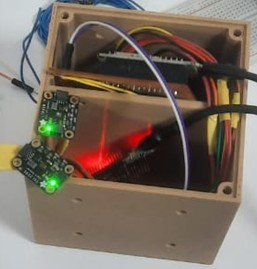
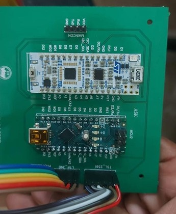
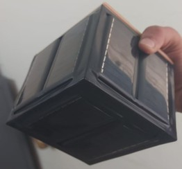
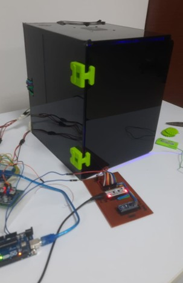
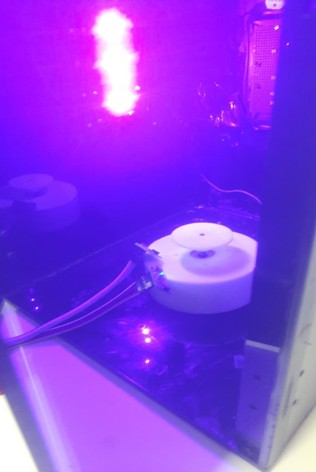
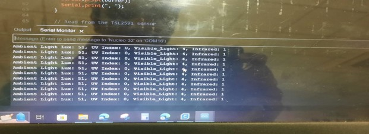

# VSAT Nano‐Satellite Project

A compact **VSAT** (Very Small Aperture Terminal) nano‐satellite designed to measure ultraviolet and infrared spectra in Low Earth Orbit (LEO). repository contains all design files, source code, and documentation for hardware, firmware, and analysis.

## 🚀 Key Features

- **UV & IR Sensing**
  - LTR390 UV sensor (300–350 nm)
  - TSL2591 ambient & IR sensor (188 µLux–88 000 Lux)
  - SD008-2151-112 photodiode (220–370 nm)
- **Modular Microcontroller Architecture**
  - STM32 / Nucleo L432KC (3.3–5 V)
  - Arduino Nano V3 (ATmega328, 5 V)
- **Robust PCB Design**
  - Multi‐layer board with solar insulation
  - Radiation‐hardened materials
  - Custom footprint for space facility CAD
- **End‐to‐End Testing**
  - Sensor calibration (UV, IR, ambient)
  - Thermal and radiation testing
  - In‐lab vacuum and communication validation

## 🔧 Setup & Usage

### Clone the Repository

   git clone https://github.com/raviteja091/vsat-nano-satellite.git\
   cd vsat-nano-satellite

### Hardware Build
   1. Open hardware/schematics/vsat\_schematic.sch in your EDA tool.
   2. Review BOM.csv for component sourcing.
   3. Fabricate PCB; assemble under ESD conditions.

### Firmware Programming
   1. **Arduino Nano**:

cd firmware/arduino\
open main.ino in Arduino IDE\
Install required sensor libraries, then upload.

1. **STM32 Nucleo**:\
   Import the firmware/stm32 project into STM32CubeIDE.\
   Build and flash via ST-Link.
1. **Calibration & Testing**
   1. Use scripts under data/calibration/ to generate calibration curves.
   1. Follow lab procedures in docs/ to validate sensor readings in UV chamber and thermal chamber.
1. **Ground Station Software**

   cd software/ground\_station\
   pip install -r requirements.txt\
   python gs\_receive.py --port /dev/ttyUSB0

## Figures

## 🏆 Achievements

- **Successful UV/IR Spectrum Measurements** in lab prototypes.
- **Robust PCB** passed thermal cycling and radiation exposure tests.
- **Fully Functional Telemetry** with ground‐station integration and real‐time plotting.
- **Got Appreciation by experts and Finalised as TOP 10 in VIKAS'2024

**📜 License**

This project is licensed under the **MIT License**. See [LICENSE](LICENSE) for details.

⁂
